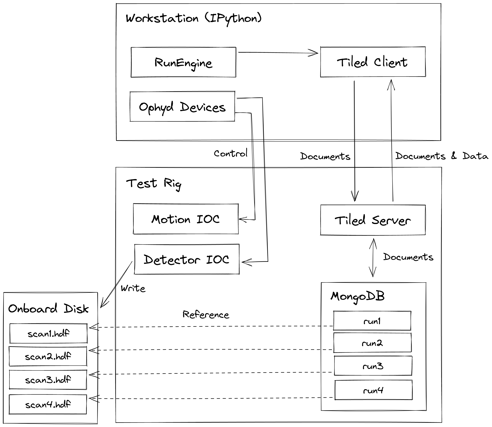

Data Access Model
=================

Data access on the test rigs does not work like a standard Diamond beamline.

The complete setup is shown below:

Why is it non-standard?
-----------------------

Due to the networking setup, the test rigs do not have fast access to the central filesystem. 
Writing data there would be impractical. Filesystem access should be limited to small read/writes.

How is Data Modelled in Bluesky?
--------------------------------

Bluesky can handle data either directly by getting PVs or by triggering an external data writer.
The former method is normally employed for small scalar data such as motor positions. The 
latter is normally employed for large multidimensional data, such as detector images that are
handled with an HDF5 writing AreaDetector plugin. In either case, documents are produced according
to the Bluesky event model that either contain recorded data or reference external data.

How is Data Stored?
-------------------

Each test rig has a large data disk installed to which its detector can write image data.
This disk is not accessible from external workstations, so the test rigs also run an HTTP
server for data access. The data is small enough that this does not have significant performance 
implications.

The rigs run NSLS-II's Tiled, which is a purpose-designed server for this use case. It includes
caching that may improve performance in certain cases. 

How are Documents Stored?
-------------------------

Tiled is run with a plugin that supports databroker, a store for event model documents.
Bluesky puts its documents to the server (backed by a mongo database). The server can 
read the documents, including the references to detector data (which is conveniently 
on the same machine), and produce it on request.
