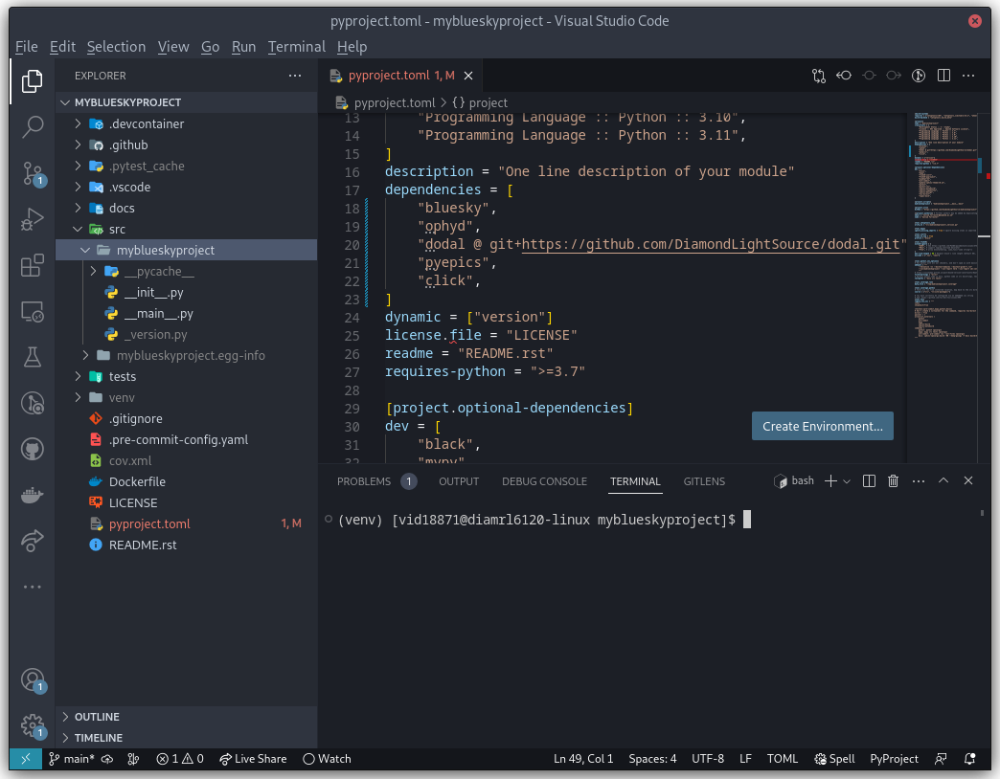
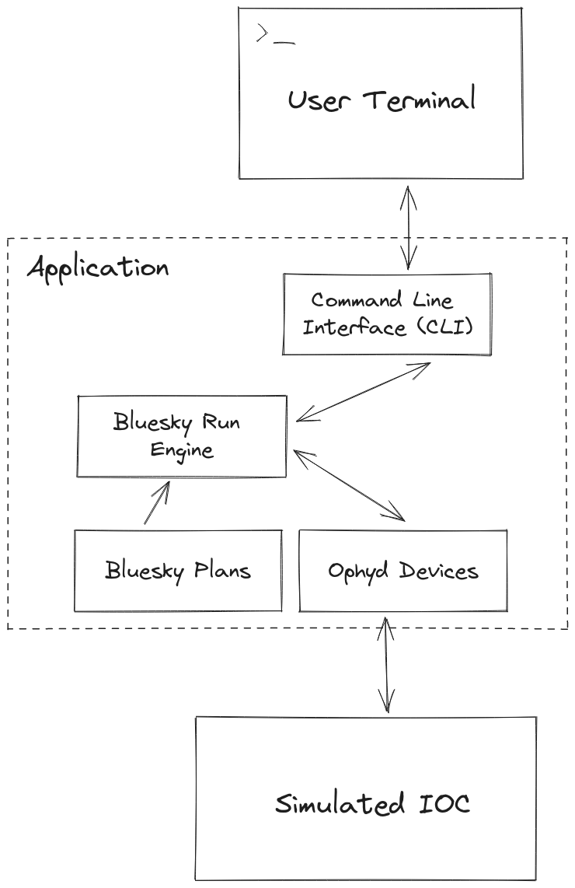

Setup your own Bluesky Project
==============================

While it is useful to play with real hardware, the limitations of availability and time may mean that developers wish to use simulated hardware.

This page, while strictly not related to the test rigs, instructs developers on how to setup their own Python project, install all of the relevant dependencies and import bluesky running against simulated hardware.

Setting up a new project
------------------------

The easiest way to setup a new project is to use the `python skeleton`_, which includes a lot of the tooling etc. for free.

.. code:: shell

    python3 -m pip install --user python3-pip-skeleton
    cd <directory where you want to put your project>
    python3-pip-skeleton new --org DiamondLightSource <name of project>

We recommend development with Microsoft Visual Studio Code, although if you have your own IDE preference and want to set it up yourself, feel free to skip the rest of this section.
Otherwise, install or ``module load vscode`` and run:

.. code:: shell

    code <your project directory>

This will open a new vscode window. Access all commands via CTRL-SHIFT-P and search for "Create new terminal" to open an integrated terminal in the IDE. 
You can either setup a `Python virtual environment`_ or a `developer container`_.

.. note:: Developer containers are not available on RHEL7

For a virtual environment:

.. code:: shell

    module load python/3.11  # Only required on DLS workstations

    cd <your project>
    python3.11 -m venv venv  # Create a new virtual env in a directory called <your project>/venv
    source venv/bin/activate  # Activate the venv for your terminal session 
    pip install -e '.[dev]'  # Install your project and it's dependencies (including development/testing dependencies) into venv

Finally, in vscode, press CTRL-SHIFT-P and search for "Python: Select Interpreter", use this to tell vscode which Python executable you will be using. Point it to ``<your project>/venv/bin/python``.

.. _`python skeleton`: https://github.com/diamondLightSource/python3-pip-skeleton
.. _`developer container`: https://epics-containers.github.io/main/user/tutorials/devcontainer.html
.. _`Python virtual environment`: https://docs.python.org/3/library/venv.html 

Installing Libraries
--------------------

Open ``<your project>/pyproject.toml`` and find the entry labelled ``"dependencies"``, add a series Bluesky related libraries so it looks something like this:

.. code:: toml

    dependencies = [
        "bluesky",
        "ophyd",
        "dodal @ git+https://github.com/DiamondLightSource/dodal.git",
        "pyepics",
        "click"
    ]

Then run:

.. code:: shell

    pip install -e '.[dev]'  # Install/update dependencies in venv

This is a minimal set of libraries to get you started. One of them, ``dodal``, includes the logic for controlling the DLS simulated AreaDetector and motors.

If you've followed along so far, your project should look something like this:

Building an Example Application
-------------------------------

Now to build a very simple application which replicates (some of) the GDA scan command. Here are its components:

Component #1: The Command Line Interface
----------------------------------------

This part of the application simply takes the user input, turns it into a machine-readable model and passes it to the business logic (bluesky). It's made using `click`_, a very user-friendly CLI library that you installed in the dependencies section earlier:

Edit the file: ``<your project>/src/<your project>/__main__.py``:

.. code:: python

    from pprint import pprint

    import click

    from . import __version__

    # Boilerplate to set up a group of click commands
    @click.group(invoke_without_command=True)
    @click.version_option(version=__version__, prog_name="htss")
    @click.pass_context
    def main(ctx) -> None:
        """Simple bluesky utility"""

        if ctx.invoked_subcommand is None:
            print("Please run a command, run with --help for help")

    # These decorators define the scan command and its arguments,
    # including information displayed in any help message.
    # This means the scan command is invoked via
    # python -m <project name> motor start stop step detectors
    @main.command(name="scan")
    @click.argument("motor", type=str)
    @click.argument("start", type=float)
    @click.argument("stop", type=float)
    @click.argument("step", type=float)
    @click.argument("detectors", type=str, nargs=-1)
    def scan(
        motor: str,
        start: float,
        stop: float,
        step: float,
        detectors: tuple[str, ...],
    ) -> None:
        """Run a scan

        MOTOR: Name of the motor to move

        START: Start position of the motor

        STOP: Final position of the motor

        STEP: Distance the motor moves at each step

        DETECTORS: Names of detectors that should acquire data at each point, separate
            by space if more than one
        """

        # We have not yet implemented our scan logic, for now
        # just print out the parameters the user put in
        print("Pretending to run a scan")
        pprint(
            {
                "motor": motor,
                "start": start,
                "stop": stop,
                "step": step,
                "detectors": detectors,
            }
        )

    # test with: python -m myblueskyproject
    if __name__ == "__main__":
        main()

There is no scan logic yet, but you can now run some commands:

.. code:: shell

    python -m myblueskyproject scan --help  # Should print out a useful help message detailing how to use your scan command
    python -m myblueskyproject scan x 0 10 0.1 adsim  # Won't run a scan yet, will just print out what it intends to do

.. _`click`: https://palletsprojects.com/p/click/

Component #2: The Ophyd Devices
-------------------------------

These will communicate with via hardware via EPICS to run your scan. This tutorial targets the DLS simulated AreaDetector and motors, which can be run via TBD.
Once they are up and running, you can use Ophyd devices from dodal to control them. Create a new file ``<your project>/src/<your project>/devices.py``:

.. code:: python

    import socket

    from dodal.adsim import AdSimDetector
    from ophyd import Device, EpicsMotor

    class DeviceRepository:
        """
        Class to hold and retrieve all devices that the application may need
        """

        _devices: dict[str, Device]

        def __init__(self) -> None:
            self._devices = {}
            self.make_devices()

        def get_device(self, name: str) -> Device:
            """
            Give the user a device with the name supplied. If there
            is not device under that name, raise a KeyError

            Args:
                name: The name of the device

            Returns:
                Device: An Ophyd device representing some hardware
            """

            return self._devices[name]

        def make_devices(self) -> None:
            """
            Initialize all devices and connect to IOCs
            """

            # Simulated AreaDetector uses the workstation name
            # in its PVs
            workstation_name = socket.gethostname()

            # Create devices representing motor and detector PVs
            self._devices = {
                "adsim": AdSimDetector(
                    name="adsim",
                    prefix=f"{workstation_name}-AD-SIM-01:",
                ),
                "x": EpicsMotor(
                    name="x",
                    prefix=f"{workstation_name}-MO-SIM-01:M1",
                ),
                "y": EpicsMotor(
                    name="y",
                    prefix=f"{workstation_name}-MO-SIM-01:M2",
                ),
                "z": EpicsMotor(
                    name="z",
                    prefix=f"{workstation_name}-MO-SIM-01:M3",
                ),
                "theta": EpicsMotor(
                    name="theta",
                    prefix=f"{workstation_name}-MO-SIM-01:M4",
                ),
                "load": EpicsMotor(
                    name="load",
                    prefix=f"{workstation_name}-MO-SIM-01:M5",
                ),
                **self._devices,
            }

            # Make all devices check that their PVs actually exist
            for device in self._devices.values():
                device.wait_for_connection()

This is a simple class to hold and connect the devices to hardware, we can edit our cli to use it, edit ``<your project>/src/<your project>/__main__.py`` and add to the scan function:
Don't forget to also import ``DeviceRepository``.

.. code:: python

    # These decorators define the scan command and its arguments,
    # including information displayed in any help message.
    # This means the scan command is invoked via
    # python -m <project name> motor start stop step detectors
    @main.command(name="scan")
    @click.argument("motor", type=str)
    @click.argument("start", type=float)
    @click.argument("stop", type=float)
    @click.argument("step", type=float)
    @click.argument("detectors", type=str, nargs=-1)
    def scan(
        motor: str,
        start: float,
        stop: float,
        step: float,
        detectors: tuple[str, ...],
    ) -> None:
        """Run a scan

        MOTOR: Name of the motor to move

        START: Start position of the motor

        STOP: Final position of the motor

        STEP: Distance the motor moves at each step

        DETECTORS: Names of detectors that should acquire data at each point, separate
            by space if more than one
        """

        # We have not yet implemented our scan logic, for now
        # just print out the parameters the user put in
        print("Pretending to run a scan")

        devices = DeviceRepository()
        actual_motor = devices.get_device(motor)
        actual_detectors = [
            devices.get_device(detector_name) for detector_name in detectors
        ]

        pprint(
            {
                "motor": actual_motor,
                "start": start,
                "stop": stop,
                "step": step,
                "detectors": actual_detectors,
            }
        )

Now if you run the previous command it should connect to the detector and print out a lot more information. Remember you may have to set the EPICS ports:

.. code:: shell

    export EPICS_CA_SERVER_PORT=6064
    export EPICS_CA_REPEATER_PORT=6065
    python -m myblueskyproject scan x 0 10 0.1 adsim

Component #3 & #4: The Plan and RunEngine
-----------------------------------------

There is a built-in Bluesky plan for running scans, although it doesn't take exactly the same parameters as the GDA scan command. It is easy to wrap it in another plan that does, however.
Create a new file ``<your project>/src/<your project>/plans.py``:

.. code:: python

    from typing import Generator

    import bluesky.plans as plans
    from bluesky.protocols import Movable, Readable

    def gda_style_scan(
        motor: Movable,
        start: float,
        stop: float,
        step: float,
        detectors: list[Readable],
    ) -> Generator:
        """
        Bluesky plan that runs a scan with similar parameters to the GDA scan command.

        Args:
            motor: Motor to move
            start: Start position
            stop: Final position
            step: Amount to move motor at each step
            detectors: Detectors that should acquire data at each step

        Yields:
            Generator: A bluesky plan that can be passed to a RunEngine
        """

        # GDA takes the step size, bluesky takes the number of steps,
        # we must convert between them
        length_of_travel = abs(stop - start)
        number_of_steps = max(1, int(length_of_travel / abs(step)))

        # Actually run a scan here
        yield from plans.scan(detectors, motor, start, stop, number_of_steps)

The final step is to create a RunEngine and pass this plan to it. Add the following imports to ``<your project>/src/<your project>/__main__.py``:

.. code:: python

    from pprint import pprint

    import click
    from bluesky import RunEngine

    from . import __version__
    from .devices import DeviceRepository
    from .plans import gda_style_scan

Then edit the scan function in the same file again:

.. code:: python

    # These decorators define the scan command and its arguments,
    # including information displayed in any help message.
    # This means the scan command is invoked via
    # python -m <project name> motor start stop step detectors
    @main.command(name="scan")
    @click.argument("motor", type=str)
    @click.argument("start", type=float)
    @click.argument("stop", type=float)
    @click.argument("step", type=float)
    @click.argument("detectors", type=str, nargs=-1)
    def scan(
        motor: str,
        start: float,
        stop: float,
        step: float,
        detectors: tuple[str, ...],
    ) -> None:
        """Run a scan

        MOTOR: Name of the motor to move

        START: Start position of the motor

        STOP: Final position of the motor

        STEP: Distance the motor moves at each step

        DETECTORS: Names of detectors that should acquire data at each point, separate
            by space if more than one
        """

        # We have not yet implemented our scan logic, for now
        # just print out the parameters the user put in
        print("Pretending to run a scan")

        # Create a run engine
        run_engine = RunEngine()

        # Create and load devices
        devices = DeviceRepository()
        actual_motor = devices.get_device(motor)
        actual_detectors = [
            devices.get_device(detector_name) for detector_name in detectors
        ]

        # Create a sequence of instructions by applying the devices to the plan,
        # tell the RunEngine to execute them
        plan_sequence = gda_style_scan(
            actual_motor,
            start,
            stop,
            step,
            actual_detectors,
        )
        scan_id = run_engine(plan_sequence)

        # Print out the scan ID
        print(f"Scan completed with ID: {scan_id}")

Now the scan should run if you run run this command, it will print out a unique scan ID at the end.

.. code:: shell

    export EPICS_CA_SERVER_PORT=6064
    export EPICS_CA_REPEATER_PORT=6065
    python -m myblueskyproject scan x 0 10 0.1 adsim

Ideas for Next Steps
--------------------

And you're done!

Feel free to add to your project, perhaps consulting the `Bluesky documentation`_.
Here are some ideas to get you started:

- Add another command, perhaps one that just takes pictures with the detector using no motors, start with the `count plan`_.
- Add some feedback via the terminal like GDA has, see `Live Visualization and Processing`_.
- Make the application capable of running a sequence of plans loaded from a file.
- Add a REST API to control the application, for example using `FastAPI`_.

.. _`Bluesky documentation`: https://blueskyproject.io/bluesky
.. _`count plan`: https://blueskyproject.io/bluesky/generated/bluesky.plans.count.html#bluesky.plans.count
.. _`Live Visualization and Processing`: https://blueskyproject.io/bluesky/callbacks.html
.. _`FastAPI`: https://fastapi.tiangolo.com/lo/
